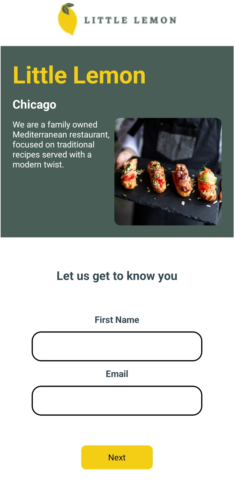
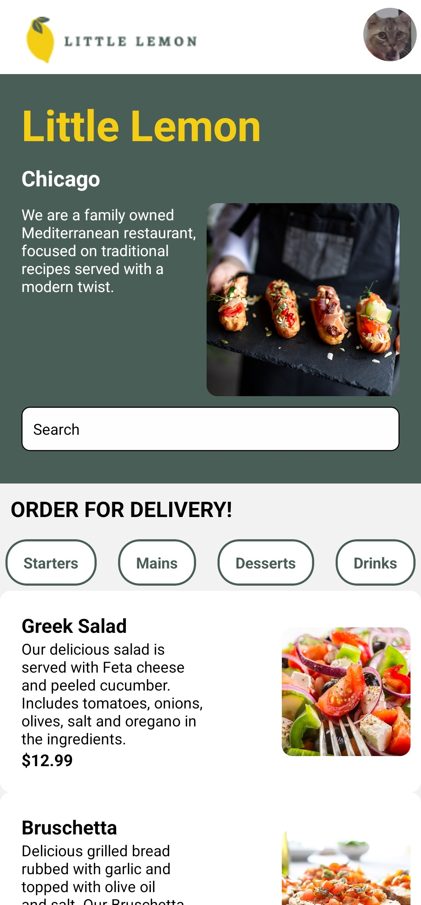
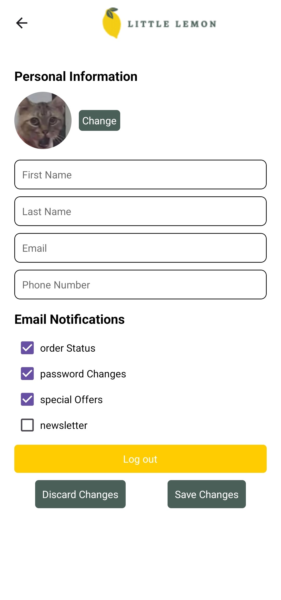

# Little Lemon Restaurant Mobile Application
This project is a mobile app for Little Lemon, a fictional Mediterranean restaurant. It is designed to display the restaurant's menu, and users can access the restaurant's menu by creating a profile.

## Overview
This website is built using React, providing a dynamic and interactive user experience. It offers a clean and user-friendly interface for customers to explore the menu, learn about Little Lemon, and make reservations. This project was developed as part of a learning exercise, demonstrating proficiency in React development.

## Features
* **Menu Display:** Browse the restaurant's menu with detailed descriptions and prices.
* **About Us:** Learn about Little Lemon's history and philosophy.
* **Responsive Design:** Ensures optimal viewing experience across various devices.
* **React Components:** Modular and reusable components for efficient development.

## Technologies
* **React:** JavaScript library for building user interfaces.
* **React Router:** Enables navigation between pages.
* **Fetch API:** For fetching data.
* **Database:** SQLite database for menu storage.
* 
## Screenshots

* **Login Page:**
    
* **Menu Page:**
    
* **Profile Page:**
    
